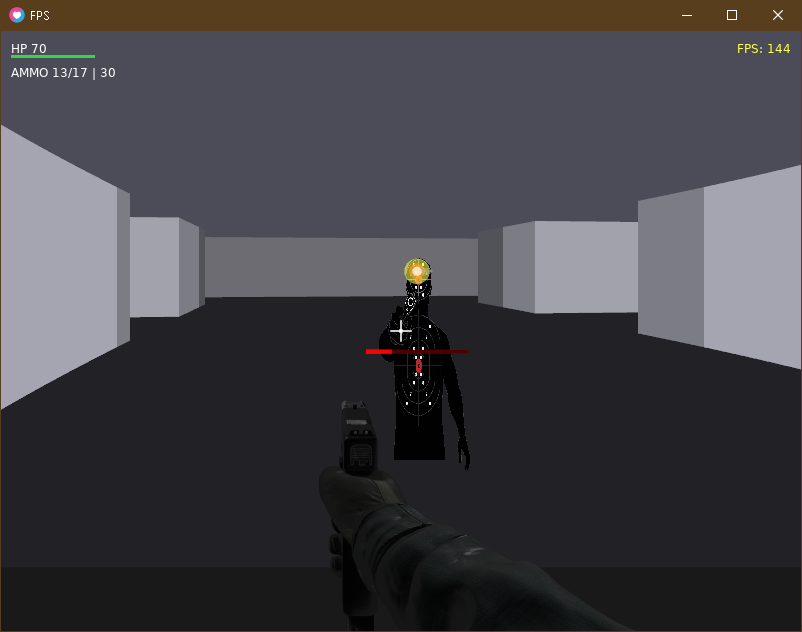

# FPS

A first-person shooter built with LÖVE (Lua).



## Requirements

- LÖVE 11.5 or higher

## Controls

- **WASD / Arrow Keys** - Move
- **Mouse** - Look around
- **Left Click** - Shoot
- **Shift** - Run
- **R** - Reload
- **F3** - Toggle debug info
- **ESC** - Pause / Resume
- **Enter** - Start (from menu)
- **R / Q** - Restart / Quit (on death or win screens)

## Running

```bash
love .
```

Or drag the project folder onto the LÖVE executable.

## Project Structure

```
├── conf.lua           # LÖVE configuration
├── main.lua           # Entry point and game loop
├── src/
│   ├── player.lua     # Player movement and collision
│   ├── map.lua        # Grid-based level data
│   ├── raycaster.lua  # DDA raycasting algorithm
│   ├── renderer.lua   # Rendering (walls, sprites, HUD)
│   ├── weapon.lua     # Shooting mechanics
│   ├── enemy.lua      # Enemy AI and behavior
│   └── input.lua      # Input handling
└── assets/
    ├── arms.png       # Weapon sprite
    ├── enemy.png      # Enemy sprite
    └── screenshot.png # Gameplay screenshot
```

## License

MIT License